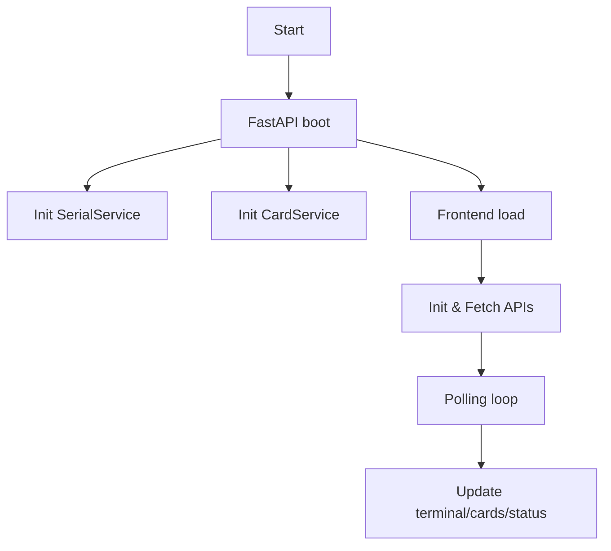
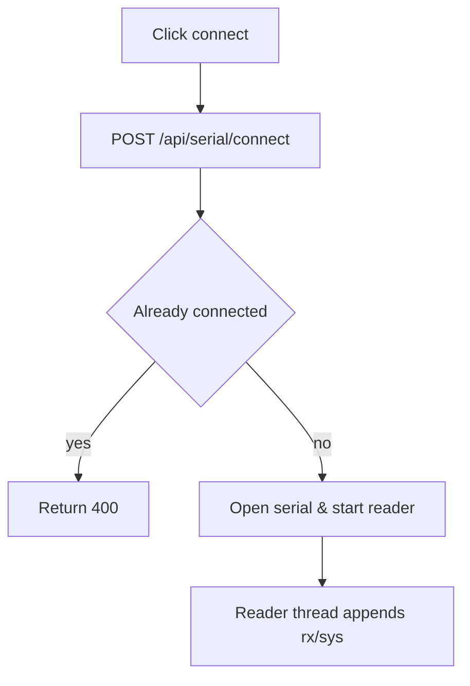
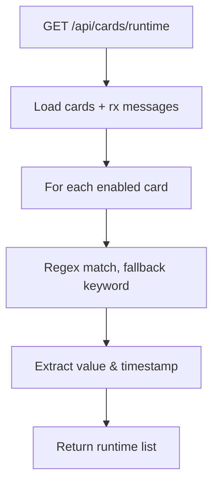
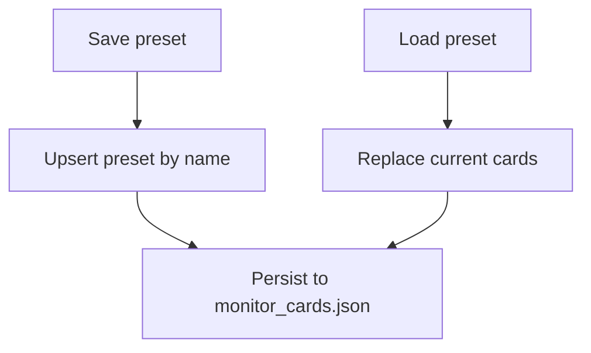

# Neo UART Assistant 系统流程图

为避免 Mermaid 渲染器中文编码问题，图内节点使用 ASCII 英文，正文说明保持中文。

## 1. 系统总览

```mermaid
flowchart TD
    A[Start] --> B[FastAPI boot]
    B --> C[Init SerialService]
    B --> D[Init CardService]
    B --> E[Frontend load]
    E --> F[Init & Fetch APIs]
    F --> G[Polling loop]
    G --> H[Update terminal/cards/status]
```

## 2. 串口连接与读线程

```mermaid
flowchart TD
    A[Click connect] --> B[POST /api/serial/connect]
    B --> C{Already connected}
    C -- yes --> C1[Return 400]
    C -- no --> D[Open serial & start reader]
    D --> E[Reader thread appends rx/sys]
```

## 3. 卡片运行态计算

```mermaid
flowchart TD
    A[GET /api/cards/runtime] --> B[Load cards + rx messages]
    B --> C[For each enabled card]
    C --> D[Regex match, fallback keyword]
    D --> E[Extract value & timestamp]
    E --> F[Return runtime list]
```

## 4. 预设保存/载入

```mermaid
flowchart TD
    A[Save preset] --> B[Upsert preset by name]
    B --> C[Persist to monitor_cards.json]
    D[Load preset] --> E[Replace current cards]
    E --> C
```
