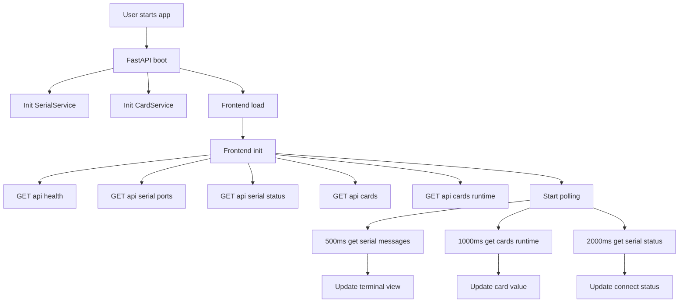
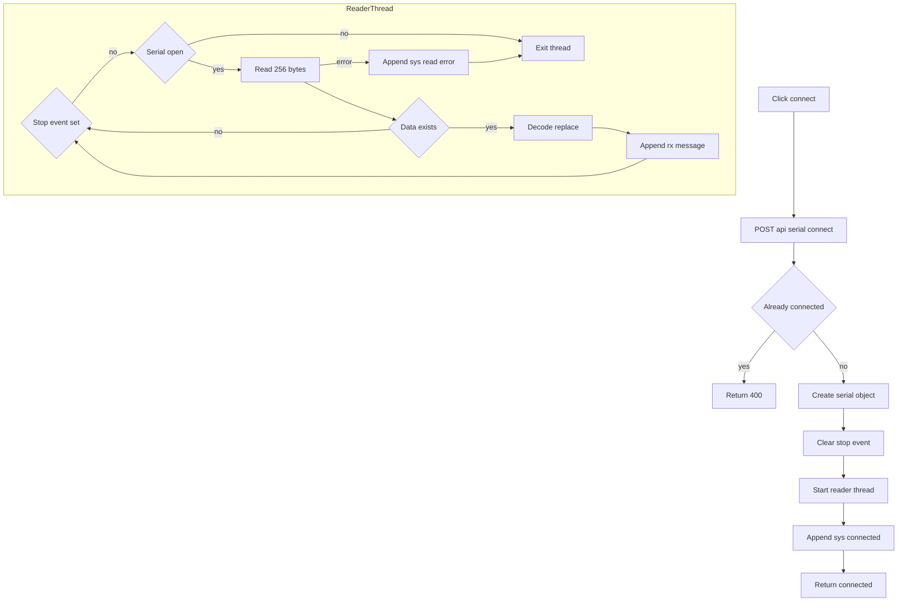
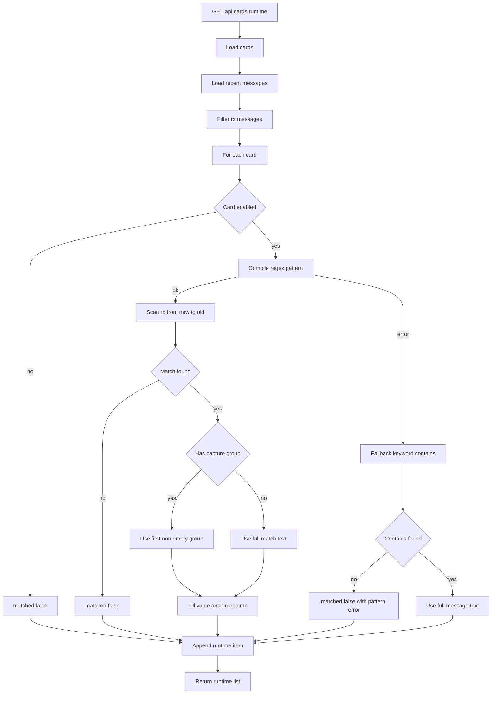
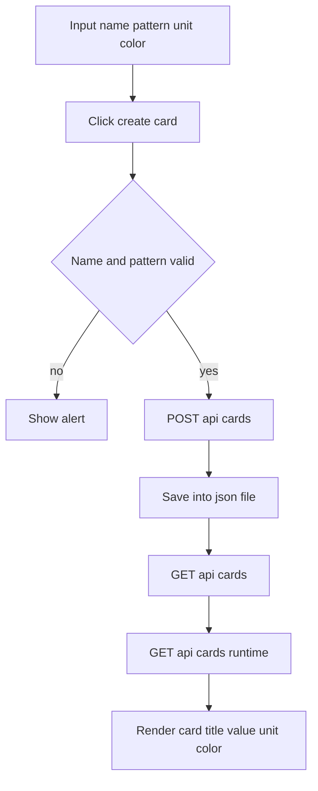
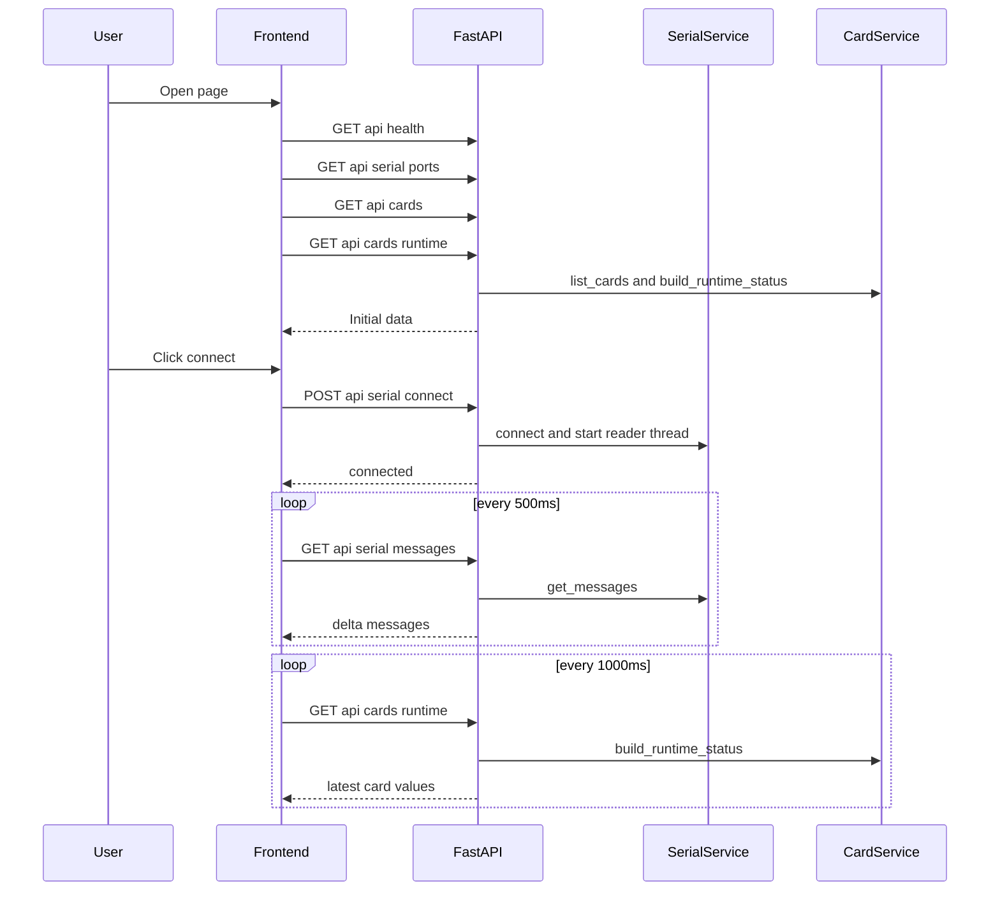

# Neo UART Assistant 流程图（现阶段）

为避免部分 Mermaid 渲染器中文编码问题，图内节点使用 ASCII 英文，文档说明保持中文。

## 1. 系统总流程

```mermaid
flowchart TD
    A[User starts app] --> B[FastAPI boot]
    B --> C[Init SerialService]
    B --> D[Init CardService]
    B --> E[Frontend load]

    E --> F[Frontend init]
    F --> F1[GET api health]
    F --> F2[GET api serial ports]
    F --> F3[GET api serial status]
    F --> F4[GET api cards]
    F --> F5[GET api cards runtime]

    F --> G[Start polling]
    G --> G1[500ms get serial messages]
    G --> G2[1000ms get cards runtime]
    G --> G3[2000ms get serial status]

    G1 --> H[Update terminal view]
    G2 --> I[Update card value]
    G3 --> J[Update connect status]
```

## 2. 串口连接与读线程流程

```mermaid
flowchart TD
    A[Click connect] --> B[POST api serial connect]
    B --> C{Already connected}
    C -- yes --> C1[Return 400]
    C -- no --> D[Create serial object]
    D --> E[Clear stop event]
    E --> F[Start reader thread]
    F --> G[Append sys connected]
    G --> H[Return connected]

    subgraph ReaderThread
        R1{Stop event set}
        R1 -- no --> R2{Serial open}
        R2 -- no --> R7[Exit thread]
        R2 -- yes --> R3[Read 256 bytes]
        R3 --> R4{Data exists}
        R4 -- no --> R1
        R4 -- yes --> R5[Decode replace]
        R5 --> R6[Append rx message]
        R6 --> R1
        R3 -->|error| R8[Append sys read error]
        R8 --> R7
    end
```

## 3. 卡片实时值计算流程

```mermaid
flowchart TD
    A[GET api cards runtime] --> B[Load cards]
    B --> C[Load recent messages]
    C --> D[Filter rx messages]
    D --> E[For each card]

    E --> F{Card enabled}
    F -- no --> F1[matched false]
    F -- yes --> G[Compile regex pattern]

    G -->|ok| H[Scan rx from new to old]
    H --> I{Match found}
    I -- no --> I1[matched false]
    I -- yes --> J{Has capture group}
    J -- yes --> J1[Use first non empty group]
    J -- no --> J2[Use full match text]
    J1 --> K[Fill value and timestamp]
    J2 --> K

    G -->|error| L[Fallback keyword contains]
    L --> M{Contains found}
    M -- no --> M1[matched false with pattern error]
    M -- yes --> M2[Use full message text]

    F1 --> N[Append runtime item]
    I1 --> N
    K --> N
    M1 --> N
    M2 --> N
    N --> O[Return runtime list]
```

## 4. 创建卡片流程（单位与颜色）

```mermaid
flowchart TD
    A[Input name pattern unit color] --> B[Click create card]
    B --> C{Name and pattern valid}
    C -- no --> C1[Show alert]
    C -- yes --> D[POST api cards]
    D --> E[Save into json file]
    E --> F[GET api cards]
    F --> G[GET api cards runtime]
    G --> H[Render card title value unit color]
```

## 5. 前后端交互时序图

```mermaid
sequenceDiagram
    participant U as User
    participant FE as Frontend
    participant API as FastAPI
    participant SS as SerialService
    participant CS as CardService

    U->>FE: Open page
    FE->>API: GET api health
    FE->>API: GET api serial ports
    FE->>API: GET api cards
    FE->>API: GET api cards runtime
    API->>CS: list_cards and build_runtime_status
    API-->>FE: Initial data

    U->>FE: Click connect
    FE->>API: POST api serial connect
    API->>SS: connect and start reader thread
    API-->>FE: connected

    loop every 500ms
        FE->>API: GET api serial messages
        API->>SS: get_messages
        API-->>FE: delta messages
    end

    loop every 1000ms
        FE->>API: GET api cards runtime
        API->>CS: build_runtime_status
        API-->>FE: latest card values
    end
```
